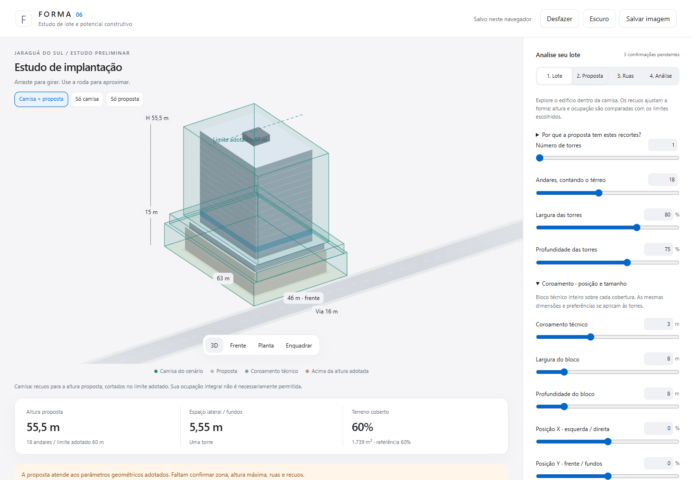
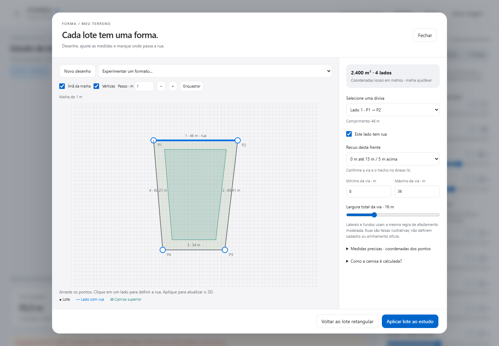
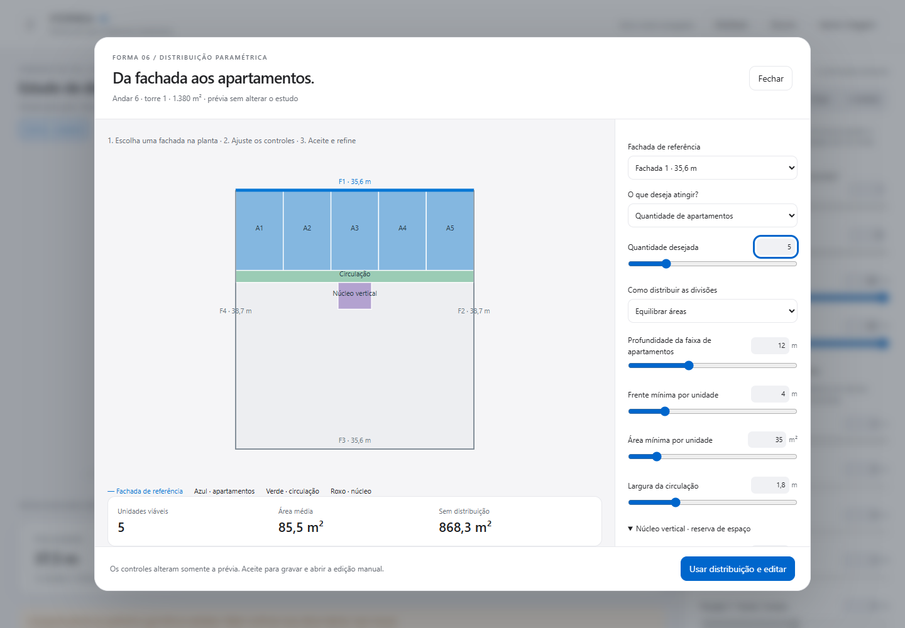
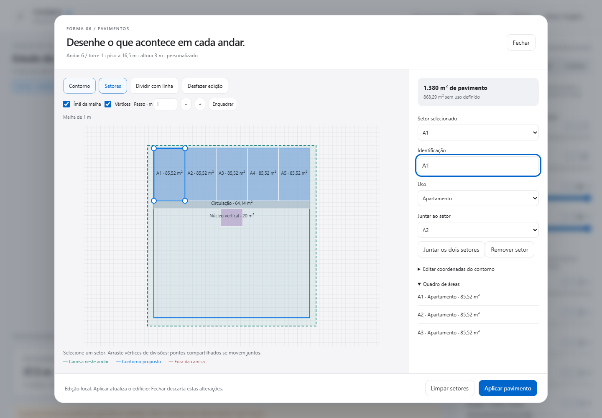

<div align="center">

# F O R M A · B U I L T

### Do lote ao volume. Da fachada à planta.

Estude a implantação, explore os andares e distribua apartamentos em uma interface visual.

**VERSÃO 06** &nbsp; · &nbsp; **EM PORTUGUÊS** &nbsp; · &nbsp; **USO LOCAL E OFFLINE**

[Começar](#comece-em-um-minuto) · [Guia visual](#guia-visual) · [Perguntas frequentes](#perguntas-frequentes) · [Validação](VALIDACAO.md)

</div>



<p align="center"><sub>Captura real da V6. Cenário ilustrativo, com parâmetros de estudo.</sub></p>

## Entenda seu lote antes de detalhar o projeto

O **FORMA BUILT** é um simulador para estudos preliminares de implantação e volumetria. Ajuste o terreno, compare o edifício com os afastamentos modelados e experimente a distribuição de apartamentos em um pavimento.

Pensado para arquitetos, urbanistas, estudantes e pessoas que precisam visualizar as possibilidades de um lote antes de avançar para um projeto detalhado.

| Você quer… | No FORMA, pode… |
| :--- | :--- |
| Entender os limites de implantação | Visualizar a **camisa do cenário** junto à proposta em 3D. |
| Estudar um terreno irregular | Desenhar seu polígono e indicar os lados voltados para ruas. |
| Comparar volumes | Ajustar torres, andares, alturas, base e ocupação da implantação. |
| Ensaiar apartamentos | Escolher uma fachada e distribuir unidades por quantidade ou área-alvo. |
| Refinar a planta | Editar vértices, dividir setores e usar uma malha com magnetismo. |
| Guardar alternativas | Salvar cenários no navegador e exportar o estudo em JSON. |

## Comece em um minuto

1. **[Baixe o projeto em ZIP](https://github.com/jhonylira/FORMA-BUILT/archive/refs/heads/main.zip).**
2. Extraia a pasta em seu computador.
3. Abra **`index.html`** em um navegador com suporte a WebGL, como Edge ou Chrome.

Não é necessário instalar programas, criar conta ou iniciar um servidor. Depois do download, o simulador funciona sem conexão. As ferramentas de desenvolvimento ao final deste guia são opcionais.

> **Primeiro experimento:** abra a aba **2. Proposta** e mova o controle de andares. Observe a altura e o afastamento lateral. Depois alterne entre **Camisa + proposta**, **Só camisa** e **Só proposta**.

## Guia visual

### 01 · Desenhe o terreno

Na aba **1. Lote**, informe as dimensões de um terreno retangular ou clique em **Desenhar / editar meu lote** para trabalhar com um polígono.



- Desenhe o contorno ou ajuste seus vértices e coordenadas em metros.
- Use o **ímã da malha** e o ajuste por **vértices** para posicionar os pontos.
- Selecione uma divisa para informar se existe uma rua naquele lado.
- Confira os parâmetros urbanísticos adotados para o estudo.

**Rua e fachada são escolhas diferentes.** A rua identifica uma frente do lote; a fachada de referência orienta a distribuição dos apartamentos dentro de um pavimento. A largura da rua não altera automaticamente os recuos.

### 02 · Explore a volumetria

Na aba **2. Proposta**, ajuste a quantidade de torres, os andares e as dimensões da implantação. Expanda **Base e alturas dos andares** para trabalhar com térreo, pavimento-tipo e base.

| Elemento | Como interpretar |
| :--- | :--- |
| **Camisa do cenário** | Volume que representa os afastamentos modelados para os parâmetros escolhidos. Sua ocupação integral não é necessariamente permitida. |
| **Proposta** | O edifício que você está estudando. Pode ser menor que a camisa por escolhas de implantação. |
| **Coroamento técnico** | Bloco sobre a cobertura para estudar uma reserva técnica, com tamanho e posição ajustáveis. |
| **Limite adotado** | Referência de altura selecionada para comparação com a proposta. |

Arraste a cena para girar e use a roda do mouse para aproximar. Os botões **3D**, **Frente**, **Planta** e **Enquadrar** ajudam a inspecionar o volume.

### 03 · Distribua apartamentos com os controles

Abaixo da visualização, em **Pavimentos e setores**, escolha um andar e clique em **Distribuir apartamentos**.



1. **Escolha a fachada:** clique em uma borda da planta ou use a lista.
2. **Defina seu objetivo:** quantidade de apartamentos ou área-alvo por unidade.
3. **Ajuste as divisões:** equilibre áreas ou frentes de fachada.
4. **Reserve a circulação:** ajuste a profundidade dos apartamentos e a largura da faixa de circulação.
5. **Posicione o núcleo:** ajuste largura, profundidade e posição da reserva vertical.
6. **Confira a prévia:** observe a quantidade encontrada, a área média e a área ainda sem distribuição.
7. Clique em **Usar distribuição e editar** para gravar o resultado e abrir a edição manual.

**Azul:** apartamentos · **Verde:** circulação · **Roxo:** núcleo vertical.

A quantidade desejada é um objetivo. Se os limites informados não permitirem todas as unidades, o app pode propor uma quantidade menor e avisa sobre a redução. Se a geometria for incompatível, a aplicação fica bloqueada.

A prévia só altera o estudo quando você aceita. Ao aceitar, os setores existentes **daquele pavimento** são substituídos; o comando **Desfazer** recupera o estado anterior.

### 04 · Refine a planta



Use **Contorno** para ajustar a forma do pavimento e **Setores** para trabalhar nas divisões internas. Você pode:

- Mover vértices com o auxílio da malha e do magnetismo.
- Dividir uma área com uma linha, nomear setores e atribuir seu uso.
- Juntar ou remover setores e acompanhar o quadro de áreas.
- Conferir a camisa e os conflitos do pavimento.
- Verificar destinos e copiar o desenho para outros andares compatíveis.

Clique em **Aplicar pavimento** para confirmar as alterações do editor. Fechar essa janela descarta as alterações manuais ainda não aplicadas; a distribuição paramétrica já aceita permanece salva.

## Leia os resultados com clareza

**Terreno coberto** indica a ocupação geométrica da projeção do edifício sobre o lote. **Altura proposta** acompanha os parâmetros dos pavimentos. A aba **4. Análise** reúne verificações, pendências e memória de cálculo do cenário.

O total de apartamentos desenhados conta os setores classificados como **Apartamento** nos pavimentos. Gerar cinco unidades em um andar não preenche automaticamente todos os outros. Para repetir a solução, use a cópia de pavimentos e confira os destinos.

As áreas dos setores são geométricas, sem espessuras de paredes. Não equivalem automaticamente à área privativa de venda. A demanda de estacionamento usa uma entrada própria de programa: confira-a após alterar a quantidade de unidades.

## Salve suas ideias

| Recurso | Para que serve |
| :--- | :--- |
| **Salvo neste navegador** | Mantém o estudo no armazenamento local, quando disponível. |
| **Guardar alternativa** | Preserva um cenário para comparar e retomar. |
| **Exportar estudo e alternativas** | Gera um arquivo JSON para guardar uma cópia dos dados. |
| **Salvar imagem** | Exporta uma imagem da visualização do modelo. |
| **Desfazer** | Recupera o estado anterior durante a sessão. |

O GitHub guarda o aplicativo, **não os seus estudos pessoais**. Exporte o JSON antes de limpar os dados do navegador, mover o arquivo do app ou trocar de computador. O armazenamento local pode variar entre navegadores e caminhos de arquivo.

## Perguntas frequentes

<details>
<summary><strong>Por que o edifício não ocupa toda a camisa?</strong></summary>

A camisa representa os afastamentos modelados. A proposta também depende da largura e profundidade das torres, da base e das escolhas de implantação. Um recorte na proposta não representa, por si só, uma exigência legal.

</details>

<details>
<summary><strong>Funciona com lotes em L e trapézios?</strong></summary>

O editor aceita lotes poligonais. O gerador de apartamentos da V6 estuda uma faixa voltada à fachada escolhida. Em L, ele trabalha apenas na ala alcançada por essa faixa e deixa o restante para edição. Algumas plantas exigem uma solução manual diferente da procurada pelo gerador.

</details>

<details>
<summary><strong>Por que a quantidade de apartamentos diminuiu?</strong></summary>

A quantidade depende da área e da frente mínimas informadas, da profundidade da faixa e do espaço para circulação e núcleo. O app verifica se os setores cabem, se não se sobrepõem e se mantêm o contato e a continuidade geométrica da circulação. Ajuste os controles ou experimente outra fachada.

</details>

<details>
<summary><strong>O app calcula IA, VGV ou lucro?</strong></summary>

A V6 não oferece calculadoras dedicadas de índice de aproveitamento, VGV ou lucro. Ela permite estudar a volumetria, a ocupação geométrica e o programa de setores e apartamentos. As análises financeiras e o cálculo completo do potencial construtivo permanecem possibilidades de evolução.

</details>

<details>
<summary><strong>Uma proposta sem alertas está aprovada pela Prefeitura?</strong></summary>

Não. Significa que passou pelas verificações implementadas para os parâmetros daquele cenário. O app não identifica automaticamente o zoneamento do imóvel nem confirma os parâmetros aplicáveis à via. As referências dos anexos e as hipóteses precisam ser conferidas para cada lote.

</details>

## Base e limites do estudo

O simulador trabalha com regras modeladas a partir da **Lei Municipal 8.343/2020 de Jaraguá do Sul** e com os parâmetros do cenário. Seu uso é de estudo preliminar; a verificação normativa do imóvel e do projeto continua necessária.

No motor atual, a camisa depende da altura máxima proposta. A distribuição dos apartamentos usa parâmetros de projeto — área, frente, profundidade, circulação e núcleo — que **não são mínimos legais comprovados**. O contato geométrico de 0,80 m usado pelo gerador não comprova a existência ou conformidade de uma porta.

Não dimensiona paredes, cômodos, escadas, elevadores, instalações, ventilação, acessibilidade, saídas de emergência ou estrutura. A possibilidade de aberturas na fachada deve ser conferida. O terreno é tratado como plano e as torres compartilham a mesma altura no modelo.

## Qualidade e validação

A V6 passou por **432 combinações geométricas**, com 352 propostas aceitas e 80 bloqueadas pelo gerador, além dos testes de edição, salvamento, magnetismo e tela pequena. Os resultados e limites estão documentados em **[VALIDACAO.md](VALIDACAO.md)**.

As imagens deste guia foram capturadas no aplicativo real com cenários ilustrativos. Os cenários não representam um lote aprovado nem um empreendimento real.

<details>
<summary><strong>Para desenvolvedores · fontes, montagem e testes</strong></summary>

O app é entregue como um HTML único, com as bibliotecas necessárias incorporadas. Os fontes ficam em `src/`; `build.py` monta a evolução dos motores V3 a V6.

**Reconstruir** — requer Python 3:

```sh
python build.py
```

**Testar** — requer Node.js e as dependências de desenvolvimento:

```sh
npm install
npx playwright install chromium
npm test
```

Para usar Edge instalado, defina `BROWSER_CHANNEL=msedge` no ambiente. Para refazer as capturas deste guia:

```sh
node tests/capture-docs.cjs
```

Bibliotecas incluídas: polygon-clipping 0.15.7 e earcut 2.2.4. Consulte as [licenças de polygon-clipping](src/polygon-clipping-LICENSE.md) e [earcut](src/earcut-LICENSE.txt), também incorporadas no HTML.

</details>

---

<p align="center"><strong>FORMA BUILT</strong><br><sub>Explore possibilidades. Compare cenários. Refine o projeto.</sub></p>
